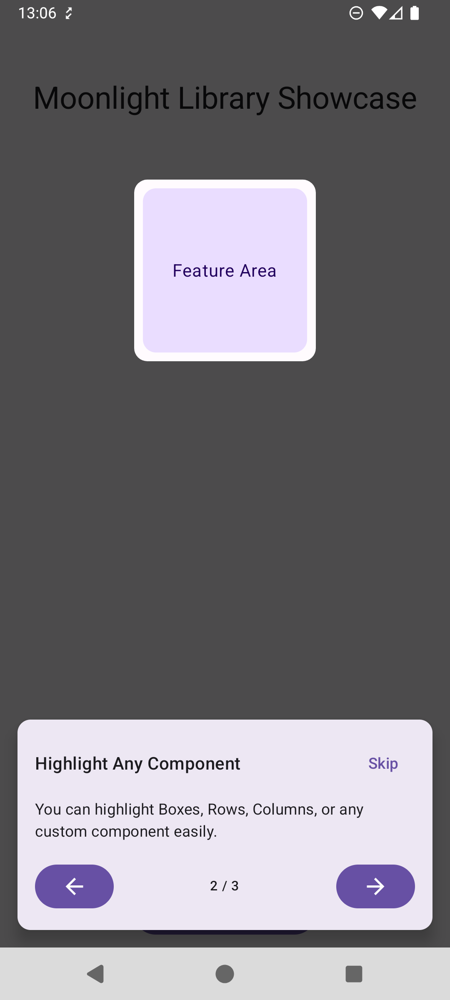
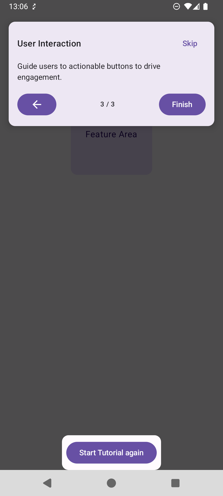

# Moonlight 🌑

Moonlight is a lightweight, modern Jetpack Compose library for creating beautiful, guided app walkthroughs and feature showcases.

<div align="center">
  
  
</div>

## Features

*   **Dynamic Positioning**: Automatically safeguards against overlap by positioning the walkthrough card (top or bottom) away from the highlighted element.
*   **System Bar Awareness**: Automatically handles status bar and navigation bar insets to ensure content is never obscured.
*   **Target Highlighting**: Uses a rounded "cutout" effect (12dp corner radius) to highlight specific UI components with an 8dp padding for breathing room.
*   **Simple State Management**: Driven by a simple state object to control visibility and step progression.
*   **Composable-First**: Built entirely with Jetpack Compose modifiers and components.
*   **Customizable Interaction**: Optional `dismissOnClick` parameter to control user flow.

## Installation

Add the dependency to your module's `build.gradle.kts`:

```kotlin
dependencies {
    implementation("com.github.Alkss:Moonlight:1.0.0")
}
```

*Note: Replace `1.0.0` with the latest version.*

## Usage

### 1. Initialize State

Use `rememberMoonlightState` to manage the visibility and steps of the tutorial.

```kotlin
val moonlightState = rememberMoonlightState(initialDecorated = false)
```

### 2. Define Steps

Create a list of `MoonlightStep` objects. Each step maps to a specific UI target via a unique `id`.

```kotlin
val steps = listOf(
    MoonlightStep(
        id = "title_id",
        title = "Welcome",
        text = "This is the title of the application."
    ),
    MoonlightStep(
        id = "feature_box",
        title = "Key Feature",
        text = "This area shows the most important data."
    )
)
```

### 3. Wrap Your Content

Wrap your screen content (e.g., `Scaffold` or root `Column`) with the `Moonlight` composable to enable the overlay.

```kotlin
Moonlight(
    state = moonlightState,
    steps = steps,
    dismissOnClick = true // Optional: Dismiss tutorial by clicking background
) {
    // Your actual screen content goes here
    MyScreenContent(moonlightState)
}
```

### 4. Tag Components

Use the `Modifier.moonlightTarget` modifier to register components for highlighting. Ensure the `id` matches one defined in your steps.

```kotlin
Text(
    text = "Hello World",
    modifier = Modifier.moonlightTarget(moonlightState, "title_id")
)

Box(
    modifier = Modifier
        .size(100.dp)
        .moonlightTarget(moonlightState, "feature_box")
) {
    // ...
}
```

### 5. Control the Walkthrough

Trigger the walkthrough visibility programmatically:

```kotlin
Button(onClick = { moonlightState.isVisible = true }) {
    Text("Start Tutorial")
}
```

## Customization

The `Moonlight` composable accepts several parameters:

*   **overlayColor**: Color of the darkened background (default: `Color.Black.copy(alpha = 0.7f)`).
*   **dismissOnClick**: Whether clicking the overlay (outside the card) dismisses the tutorial (default: `false`).

## License

```text
Copyright 2026 Moonlight Contributors

Licensed under the Apache License, Version 2.0 (the "License");
you may not use this file except in compliance with the License.
You may obtain a copy of the License at

   http://www.apache.org/licenses/LICENSE-2.0

Unless required by applicable law or agreed to in writing, software
distributed under the License is distributed on an "AS IS" BASIS,
WITHOUT WARRANTIES OR CONDITIONS OF ANY KIND, either express or implied.
See the License for the specific language governing permissions and
limitations under the License.
```
